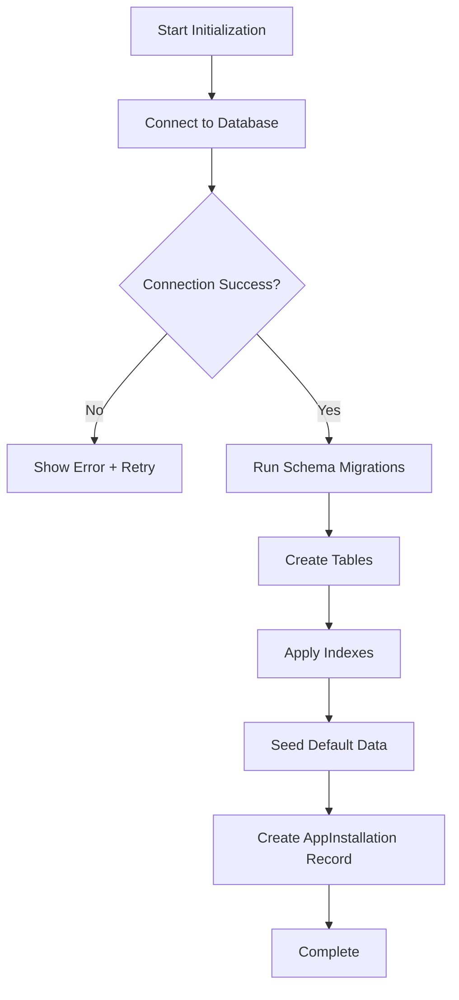

# First Run Setup Wizard Architecture

## OrderTrackingApp - Technical Specification

---

## 1. Panoramica

Il First Run Setup Wizard è un componente critico che gestisce la configurazione iniziale dell'applicazione OrderTrackingApp al primo avvio. Garantisce che tutti i prerequisiti siano satisfied prima di permettere l'accesso all'applicazione.

### Flusso di Alto Livello

```
┌─────────────────────────────────────────────────────────────────┐
│                      APPLICATION START                            │
└─────────────────────┬───────────────────────────────────────────────┘
                      │
                      ▼
┌─────────────────────────────────────────────────────────────────┐
│              InstallationStateService                           │
│         (Check: Is First Run Complete?)                          │
└─────────────────────┬───────────────────────────────────────────────┘
                      │
           ┌──────────┴──────────┐
           │                     │
       YES │                     │ NO
           ▼                     ▼
┌─────────────────┐    ┌─────────────────────────────────────────┐
│  MAIN APP       │    │     REDIRECT TO /setup              │
│  (Normal Flow) │    │     (Setup Wizard Entry Point)      │
└─────────────────┘    └─────────────────────────────────────────┘
```

---

## 2. Rilevamento First Run

### 2.1 Installation State Detection

```csharp
public interface IInstallationStateService
{
    Task<InstallationState> GetCurrentStateAsync();
    Task MarkInstallationCompleteAsync(InstallationCompleteResult result);
    bool IsFirstRunRequired();
}

public enum InstallationState
{
    NotStarted,
    PrerequisitesValidated,
    DatabaseConfigured,
    DatabaseInitialized,
    SuperadminCreated,
    Complete,
    Failed
}
```

### 2.2 Logic di Rilevamento

| Stato Installation | Condizione |-Azione |
|-------------------|------------|--------|
| `NotStarted` | Tabella `AppInstallation` non esiste o vuota | Redirect a Step 1 |
| `PrerequisitesValidated` | Step 1 completato | Resume da Step 2 |
| `DatabaseConfigured` | Step 2 completato | Resume da Step 3 |
| `DatabaseInitialized` | Step 3 completato | Resume da Step 4 |
| `SuperadminCreated` | Step 4 completato | Redirect a Step 5 |
| `Complete` | Setup completato | Redirect a login |
| `Failed` | Setup precedentemente fallito | Allow retry |

### 2.3 Middleware di Redirect

```csharp
public class FirstRunSetupMiddleware
{
    private readonly RequestDelegate _next;
    private readonly IInstallationStateService _stateService;

    public async Task InvokeAsync(HttpContext context)
    {
        // Skip if already on /setup routes
        if (context.Request.Path.StartsWithSegments("/setup"))
        {
            await _next(context);
            return;
        }

        // Skip if login or static assets
        if (IsPublicRoute(context.Request.Path))
        {
            await _next(context);
            return;
        }

        var state = await _stateService.GetCurrentStateAsync();
        
        if (state != InstallationState.Complete)
        {
            context.Response.Redirect("/setup");
            return;
        }

        await _next(context);
    }
}
```

---

## 3. Wizard Steps - Dettaglio

### 3.1 Step 1: Prerequisiti

```
┌────────────────────────────────────────────────────────────────┐
│  STEP 1: PREREQUISITI                                         │
├────────────────────────────────────────────────────────────────┤
│                                                                │
│  ┌──────────────┐    ┌──────────────┐    ┌──────────────┐     │
│  │   .NET 8.0   │    │  Node.js 20+ │    │   Git       │     │
│  │   REQUIRED  │    │  REQUIRED    │    │  OPTIONAL   │     │
│  └──────┬───────┘    └──────┬───────┘    └──────┬───────┘     │
│         │                   │                   │             │
│         └─────────┬─────────┴─────────┬─────────┘             │
│                   ▼                    ▼                        │
│            ┌─────────────────────────────────────┐            │
│            │     SYSTEM PREREQUISITES CHECK       │            │
│            │     - Ports Available               │            │
│            │     - File System Permissions        │            │
│            │     - Memory Requirements            │            │
│            └──────────────────┬──────────────────┘            │
│                               │                                │
│                               ▼                                │
│            ┌─────────────────────────────────────┐            │
│            │     DATABASE PREREQUISITES          │            │
│            │     Selected DB Installation       │            │
│            └─────────────────────────────────────┘            │
└────────────────���───────────────────────────────────────────────┘
```

#### Checklist Validazione

| Requisito | Controllo | Severity |
|----------|----------|----------|
| .NET 8.0+ | `dotnet --version` | Required |
| Node.js 20+ | `node --version` | Required |
| HTTPS Port (443/8443) | Bind attempt | Required |
| DB Client Libraries | Connection test | Required |
| Disk Space (500MB) | `df` | Required |
| Memory (2GB) | `free` | Required |

#### UI Components

```typescript
interface PrerequisiteCheck {
  name: string;
  checkCommand: string;
  expectedOutput: string;
  isRequired: boolean;
  status: 'pending' | 'passed' | 'failed';
}
```

### 3.2 Step 2: Database Configuration

```
┌────────────────────────────────────────────────────────────────┐
│  STEP 2: DATABASE CONFIGURATION                               │
├────────────────────────────────────────────────────────────────┤
│                                                                │
│  ┌─────────────────────────────────────────────────────────┐   │
│  │              DATABASE PROVIDER SELECTION                 │   │
│  │  ┌─────────┐ ┌─────────┐ ┌─────────┐ ┌─────────┐ ┌─────────┐   │   │
│  │  │SQLite  │ │MariaDB │ │ MySQL   │ │ Postgres│ │SQL Server│   │   │
│  │  │ DEV    │ │        │ │        │ │        │ │         │   │   │
│  │  └────┬──┘ └────┬──┘ └────┬───┘ └────┬────┘ └────┬─────┘   │   │
│  │       │        │        │        │        │        │           │   │   │
│  │       │        │        │        │        │        │           │   │   │
│  │       └──┬─────┴───┬────┴──┬─────┴───┬────┴───┬────┘           │   │
│  │          ▼         ▼       ▼        ▼        ▼               │   │
│  │     ┌────────────────────────────────────────────────────┐    │   │
│  │     │    DatabaseConfigurationProvider                 │    │   │
│  │     │         (Strategy Pattern)                        │    │   │
│  │     └────────────────────────────────────────────────────┘    │   │
│  └─────────────────────────────────────────────────────────────┘   │
│                                                                │
│  ┌─────────────────────────────────────────────────────────┐   │
│  │              CONNECTION PARAMETERS                       │   │
│  │  ┌──────────────────────────────────────────────────┐   │   │
│  │  │  Host:     [__________________] : [PORT]         │   │   │
│  │  │  Database: [__________________]                    │   │   │
│  │  │  Username: [__________________]                    │   │   │
│  │  │  Password: [__________________] 🔒               │   │   │
│  │  │  SSL Mode:  [▼ Prefer] [Require] [Disable]        ���   │   │
│  │  └──────────────────────────────────────────────────┘   │   │
│  └─────────────────────────────────────────────────────────┘   │
│                                                                │
│  [TEST CONNECTION] ─────────────► [SAVE & NEXT]                │
└────────────────────────────────────────────────────────────────┘
```

#### Database Provider Strategy

```csharp
public interface IDatabaseConfigurationProvider
{
    string ProviderName { get; }
    string DefaultPort { get; }
    string ConnectionStringTemplate { get; }
    
    Task<bool> TestConnectionAsync(ConnectionConfig config);
    string BuildConnectionString(ConnectionConfig config);
    IEnumerable<DatabaseOption> GetAvailableOptions(ConnectionConfig config);
}

public class MariaDbProvider : IDatabaseConfigurationProvider
{
    public string ProviderName => "MariaDB";
    public string DefaultPort => "3306";
    
    public string ConnectionStringTemplate => 
        "Server={host};Port={port};Database={database};User={username};Password={password};";
    
    public async Task<bool> TestConnectionAsync(ConnectionConfig config)
    {
        using var connection = new MySqlConnection(BuildConnectionString(config));
        await connection.OpenAsync();
        return true;
    }
}

public class MySqlProvider : IDatabaseConfigurationProvider
{
    public string ProviderName => "MySQL";
    public string DefaultPort => "3306";
    
    public string ConnectionStringTemplate => 
        "Server={host};Port={port};Database={database};User={username};Password={password};SSL Mode={sslMode};";
    
    // Implementation similar to MariaDB
}

public class PostgreSqlProvider : IDatabaseConfigurationProvider
{
    public string ProviderName => "PostgreSQL";
    public string DefaultPort => "5432";
    
    public string ConnectionStringTemplate => 
        "Host={host};Port={port};Database={database};Username={username};Password={password};SSL Mode={sslMode};";
}

public class SqlServerProvider : IDatabaseConfigurationProvider
{
    public string ProviderName => "SQL Server";
    public string DefaultPort => "1433";
    
    public string ConnectionStringTemplate => 
        "Server={host},{port};Database={database};User Id={username};Password={password};TrustServerCertificate={trustCert};";
}

public class SqliteProvider : IDatabaseConfigurationProvider
{
    public string ProviderName => "SQLite";
    public string DefaultPort => "N/A";
    
    public string ConnectionStringTemplate => 
        "Data Source={database}.db";
    
    public bool SupportsConnectionPooling => false;
    public bool SupportsSsl => false;
}
```

#### Connection Configuration Model

```csharp
public class ConnectionConfig
{
    public string Provider { get; set; }
    public string Host { get; set; }
    public int Port { get; set; }
    public string Database { get; set; }
    public string Username { get; set; }
    public string Password { get; set; }
    public SslMode SSLMode { get; set; }
    public int ConnectionTimeout { get; set; } = 30;
    public int CommandTimeout { get; set; } = 60;
}

public enum SslMode
{
    Prefer,
    Require,
    Disable
}
```

#### Supported Features per Database

| Feature | MariaDB | MySQL | PostgreSQL | SQL Server | SQLite |
|---------|--------|-------|-----------|------------|--------|
| Basic Connection | ✅ | ✅ | ✅ | ✅ | ✅ |
| SSL/TLS | ✅ | ✅ | ✅ | ✅ | ❌ |
| Connection Pooling | ✅ | ✅ | ✅ | ✅ | ❌ |
| Migrations | ✅ | ✅ | ✅ | ✅ | ✅ |
| JSON Operations | ✅ | ✅ | ✅ | ✅ | ✅ |
| Full-Text Search | ✅ | ✅ | ✅ | ✅ | ✅ |
| Spatial/GIS | ✅ | ✅ | ✅ | ✅ | ❌ |
| Row-Level Security | ❌ | ❌ | ✅ | ✅ | ❌ |
| Parallel Queries | ✅ | ✅ | ✅ | ✅ | ❌ |
| Max Connections | 2000 | 2000 | 100 | 32767 | 1 |
| **Use Case** | Legacy MySQL | Production | Production | Enterprise | Dev/Demo |

### 2B: Installation Profiles

Il wizard supporta tre profili di installazione predefiniti che determinano quali step vengono eseguiti e quali opzioni sono disponibili.

#### 2B.1 Profili Disponibili

```
┌─────────────────────────────────────────────────────────────────────────┐
│                INSTALLATION PROFILES                                       │
├─────────────────────────────────────────────────────────────────────────┤
│                                                                          │
│  ┌─────────────────┐  ┌─────────────────┐  ┌─────────────────────┐ │
│  │    EXPRESS      │  │   STANDARD      │  │     ADVANCED         │ │
│  ├─────────────────┤  ├─────────────────┤  ├─────────────────────┤ │
│  │  • 5 min setup  │  │  • Full config  │  │  • Full custom      │ │
│  │  • SQLite only  │  │  • All DBs      │  │  • Custom params   │ │
│  │  • Demo mode   │  │  • Production   │  │  • Enterprise      │ │
│  │  • Quick start │  │  • Balanced    │  │  • Expert only    │ │
│  └────────┬────────┘  └────────┬────────┘  └────────┬────────────┘ │
│           │                      │                      │              │
│           └──────────────────────┼──────────────────────┘              │
│                                  │                                       │
│                                  ▼                                       │
│                   ┌──────────────────────────────┐                        │
│                   │   INSTALLATION PROFILE        │                        │
│                   │   SELECTION SCREEN            │                        │
│                   └──────────────────────────────┘                        │
└─────────────────────────────────────────────────────────────────────────┘
```

#### 2B.2 Confronto Profili

| Caratteristica | Express | Standard | Advanced |
|--------------|---------|----------|----------|
| **Durata stimata** | 5 min | 15-20 min | 30-45 min |
| **Database** | SQLite only | MariaDB, MySQL, PostgreSQL, SQL Server | Tutti + custom |
| **StepWizard** | 3 step | 5 step | 5 step + opzioni extra |
| **Prerequisiti** | Minimi | Completi | Completi + audit |
| **SSL/TLS** | ❌ | ✅ | ✅ |
| **Connection Pool** | ❌ | ✅ Configurabile | ✅ Advanced |
| **Sample Data** | ✅ Auto | ✅ Optional | ✅ Customizable |
| **Logging** | Base | SignalR | SignalR + file |
| **Security Hardening** | ❌ | ✅ Standard | ✅ Full |
| **Backup Config** | ❌ | ✅ | ✅ |
| **Expert Features** | ❌ | ❌ | ✅ |

#### 2B.3 Profilo Express

```
┌────────────────────────────────────────────────────────────────┐
│  EXPRESS PROFILE - Quick Start Flow                              │
├────────────────────────────────────────────────────────────────┤
│                                                                │
│  ┌─────────────────────────────────────────────────────────┐   │
│  │                    STEP 1: Quick Check                     │   │
│  │  [.NET detected] [Node detected] [Port 5000 available]  │   │
│  │                                                            │   │
│  │  [✓] All checks passed - Ready to continue                 │   │
│  └─────────────────────────────────────────────────────────┘   │
│                                                                │
│                           ▼                                   │
│  ┌─────────────────────────────────────────────────────────┐   │
│  │              STEP 2: Database (SQLite ONLY)                │   │
│  │                                                            │   │
│  │  Database File: [data/ordertracking.db]                   │   │
│  │                                                            │   │
│  │  [✓] Create new database                                  │   │
│  │  [ ] Use existing                                         │   │
│  └─────────────────────────────────────────────────────────┘   │
│                                                                │
│                           ▼                                   │
│  ┌─────────────────────────────────────────────────────────┐   │
│  │                 STEP 3: Quick Admin                      │   │
│  │  Username: [admin]                                       │   │
│  │  Password: [••••••••••••]                               │   │
│  └──────────────────────────────���──────────────────────────┘   │
│                                                                │
│                           ▼                                   │
│                    [LAUNCH APP]                               │
└────────────────────────────────────────────────────────────────┘
```

#### 2B.4 Profilo Standard

```
┌────────────────────────────────────────────────────────────────┐
│  STANDARD PROFILE - Production Ready Flow                      │
├────────────────────────────────────────────────────────────────┤
│                                                                │
│  STEP 1: Prerequisiti (Full Check)                             │
│  STEP 2: Database Configuration (Select DB + Connection)       │
│  STEP 3: Database Initialization (Live Log)                    │
│  STEP 4: Superadmin Creation (Secure)                          │
│  STEP 5: Finalize + Options                                    │
└────────────────────────────────────────────────────────────────┘
```

#### 2B.5 Profilo Advanced

```
┌────────────────────────────────────────────────────────────────┐
│  ADVANCED PROFILE - Full Customization                        │
├────────────────────────────────────────────────────────────────┤
│                                                                │
│  STEP 1: Prerequisiti (Full + Audit)                         │
│  STEP 2: Database Configuration (Full + Advanced Options)      │
│         • Connection Pool Settings                            │
│         • SSL/TLS Certificate Options                         │
│         • Replication Settings                               │
│         • Backup Configuration                               │
│  STEP 3: Database Initialization (Full + Custom Migrations)    │
│  STEP 4: Superadmin Creation (MFARecommended + Policies)      │
│  STEP 5: Finalize + Security Hardening + Backup Setup          │
│                                                                │
│  EXTRA OPTIONS:                                                │
│  • Custom environment variables                               │
│  • Application settings preview                              │
│  • Pre-deployment checklist                                  │
│  • Integration test suite setup                              │
└────────────────────────────────────────────────────────────────┘
```

#### 2B.6 Profilo Implementation

```csharp
public enum InstallationProfile
{
    Express,    // Quick start, SQLite, minimal
    Standard,   // Full production setup
    Advanced   // Enterprise with custom options
}

public interface IInstallationProfileService
{
    InstallationProfile GetCurrentProfile();
    IEnumerable<InstallationProfile> GetAvailableProfiles();
    bool CanUseProfile(InstallationProfile profile);
    IDatabaseProvider GetAllowedDatabases(InstallationProfile profile);
    int GetMaxSteps(InstallationProfile profile);
    SetupOptions GetDefaultOptions(InstallationProfile profile);
}

public class InstallationProfileService : IInstallationProfileService
{
    public IDatabaseProvider GetAllowedDatabases(InstallationProfile profile)
    {
        return profile switch
        {
            InstallationProfile.Express => new[] { "sqlite" },
            InstallationProfile.Standard => new[] { "mariadb", "mysql", "postgresql", "sqlserver" },
            InstallationProfile.Advanced => AllProviders,
            _ => throw new InvalidOperationException()
        };
    }
    
    public SetupOptions GetDefaultOptions(InstallationProfile profile)
    {
        return profile switch
        {
            InstallationProfile.Express => new SetupOptions
            {
                SkipPrerequisites = false,
                AutoCreateSampleData = true,
                EnableLiveLogging = false,
                EnableSecurityHardening = false
            },
            InstallationProfile.Standard => new SetupOptions
            {
                SkipPrerequisites = false,
                AutoCreateSampleData = true,
                EnableLiveLogging = true,
                EnableSecurityHardening = true
            },
            InstallationProfile.Advanced => new SetupOptions
            {
                SkipPrerequisites = false,
                AutoCreateSampleData = false,
                EnableLiveLogging = true,
                EnableSecurityHardening = true,
                EnableCustomMigrations = true,
                EnableBackupConfig = true
            },
            _ => throw new InvalidOperationException()
        };
    }
}
```

#### 2B.7 Profugo Selection Flow

```
┌─────────────────────────────────────────────────────────────────────────┐
│         PROFILE SELECTION DECISION TREE                                    │
├─────────────────────────────────────────────────────────────────────────┤
│                                                                          │
│                         ┌─────────────────────┐                            │
│                         │  First time user?   │                            │
│                         └──────────┬──────────┘                            │
│                                    │                                       │
│               ┌────────────────────┼────────────────────┐                │
│               │ YES                │                   │ NO                  │
│               ▼                    │                   ▼                     │
│  ┌─────────────────────┐           │        ┌─────────────────────┐              │
│  │  Need production?  │           │        │  Expert user?      │              │
│  └────────┬──────────┘           │        └─────────┬─────────┘              │
│           │                        │                  │                        │
│    ┌──────┴──────┐              │           ┌──────┴──────┐               │
│    │             │              │           │             │               │
│ YES▼            ▼NO         │         YES▼         ▼NO              │
│ ┌──────────┐ ┌──────────┐   │    ┌──────────┐ ┌──────────┐              │
│ │ EXPRESS │ │STANDARD │   │    │STANDARD │ │ADVANCED │              │
│ └─────────┘ └─────────┘   │    └─────────┘ └──────────┘              │
│                            │                                          │
└────────────────────────────┴──────────────────────────────────────────┘
```

### 3.3 Step 3: Database Initialization

```
┌────────────────────────────────────────────────────────────────┐
│  STEP 3: DATABASE INITIALIZATION                             │
├────────────────────────────────────────────────────────────────┤
│                                                                │
│  LIVE LOGGING (SignalR Hub)                                   │
│                                                                │
│  ┌─────────────────────────────────────────────────────────┐   │
│  │  ┌──────────────────────────────────────────────────→   │   │
│  │  │  [===............] 30% Applying migrations...     │   │
│  │  │  [======.........] 60% Creating tables...          │   │
│  │  │  [=========>] 100% Seeding data...                 │   │
│  │  └──────────────────────────────────────────────────    │   │
│  │                    ▲                                    │   │
│  │                    │ Real-time updates                │   │
│  └────────────────────┴───────────────────────────────────┘   │
│                                                                │
│  OPERATION LOG                                                │
│  ┌─────────────────────────────────────────────────────────┐   │
│  │ [INFO] 2026-04-26 10:00:00 - Connecting to database... │   │
│  │ [INFO] 2026-04-26 10:00:01 - Connection successful     │   │
│  │ [INFO] 2026-04-26 10:00:01 - Creating schema...        │   │
│  │ [INFO] 2026-04-26 10:00:02 - Table: Orders             │   │
│  │ [INFO] 2026-04-26 10:00:02 - Table: OrderItems         │   │
│  │ [INFO] 2026-04-26 10:00:03 - Table: Customers          │   │
│  │ [INFO] 2026-04-26 10:00:04 - Table: Users              │   │
│  │ [INFO] 2026-04-26 10:00:05 - Seeding default data...   │   │
│  │ [SUCCESS] Database initialized successfully           │   │
│  └─────────────────────────────────────────────────────────┘   │
└──────────��─��───────────────────────────────────────────────────┘
```

#### SignalR Live Logging Architecture

```csharp
public class SetupProgressHub : Hub
{
    public async Task JoinSetupSession(string sessionId)
    {
        await Groups.AddToGroupAsync(Context.ConnectionId, sessionId);
    }
    
    public async Task SendProgress(SetupProgress progress)
    {
        await Clients.Group(progress.SessionId).SendAsync("ProgressUpdate", progress);
    }
}

public class SetupProgress
{
    public string SessionId { get; set; }
    public string CurrentOperation { get; set; }
    public int PercentComplete { get; set; }
    public SetupStatus Status { get; set; }
    public List<string> LogEntries { get; set; }
    public string? ErrorMessage { get; set; }
}

public enum SetupStatus
{
    Running,
    Completed,
    Failed,
    RolledBack
}
```

#### Initialization Flow



#### Database Schema (AppInstallation)

```sql
-- Table: AppInstallation
CREATE TABLE AppInstallation (
    InstallationId UNIQUEIDENTIFIER PRIMARY KEY DEFAULT NEWID(),
    InstallationDate DATETIME2 NOT NULL DEFAULT GETUTCDATE(),
    CompletedDate DATETIME2 NULL,
    CurrentState VARCHAR(50) NOT NULL,
    PreviousState VARCHAR(50) NULL,
    DatabaseProvider VARCHAR(20) NOT NULL,
    DatabaseServer VARCHAR(255) NOT NULL,
    DatabaseName VARCHAR(100) NOT NULL,
    DatabasePort INT NOT NULL,
    CreatedBy VARCHAR(100) NULL,
    LastErrorMessage NVARCHAR(MAX) NULL,
    IsLocked BIT NOT NULL DEFAULT 0,
    LockedAt DATETIME2 NULL,
    LockedBySessionId UNIQUEIDENTIFIER NULL,
    CONSTRAINT CK_State CHECK (
        CurrentState IN (
            'NotStarted',
            'PrerequisitesValidated', 
            'DatabaseConfigured',
            'DatabaseInitialized',
            'Complete',
            'Failed'
        )
    )
);

-- Audit Table
CREATE TABLE AppInstallationHistory (
    HistoryId UNIQUEIDENTIFIER PRIMARY KEY DEFAULT NEWID(),
    InstallationId UNIQUEIDENTIFIER NOT NULL,
    PreviousState VARCHAR(50) NOT NULL,
    NewState VARCHAR(50) NOT NULL,
    ChangedAt DATETIME2 NOT NULL DEFAULT GETUTCDATE(),
    ChangedBySessionId UNIQUEIDENTIFIER NULL,
    Details NVARCHAR(MAX) NULL,
    FOREIGN KEY (InstallationId) REFERENCES AppInstallation(InstallationId)
);
```

### 3.4 Step 4: Superadmin Creation

```
┌────────────────────────────────────────────────────────────────┐
│  STEP 4: SUPERADMIN CREATION                                   │
├────────────────────────────────────────────────────────────────┤
│                                                                │
│  ACCOUNT DETAILS                                               │
│  ┌─────────────────────────────────────────────────────────┐   │
│  │  Username:     [__________________] (3-50 chars)      │   │
│  │  Email:       [__________________] (valid email)        │   │
│  │  Password:   [__________________] 🔒 (min 12 chars)     │   │
│  │  Confirm:    [__________________] 🔒                   │   │
│  └──��─��────────────────────────────────────────────────────┘   │
│                                                                │
│  PASSWORD REQUIREMENTS                                         │
│  ┌─────────────────────────────────────────────────────────┐   │
│  │  [✓] Min 12 characters                                   │   │
│  │  [✓] At least one uppercase letter                       │   │
│  │  [✓] At least one lowercase letter                      │   │
│  │  [✓] At least one number                               │   │
│  │  [✓] At least one special character (!@#$%^&*)         │   │
│  │  [✓] Not common password                                │   │
│  └─────────────────────────────────────────────────────────┘   │
│                                                                │
│  ┌─────────────────────────────────────────────────────────┐   │
│  │  STRONG PASSWORD GENERATOR         [Generate Strong]   │   │
│  └─────────────────────────────────────────────────────────┘   │
│                                                                │
│  [BACK] ─────────────────────────────────────► [CREATE]       │
└────────────────────────────────────────────────────────────────┘
```

#### Security Implementation

```csharp
public class SuperadminService
{
    private readonly IUserRepository _userRepository;
    private readonly IPasswordHasher _passwordHasher;
    private readonly IInstallationStateService _stateService;

    public async Task<SuperadminCreationResult> CreateSuperadminAsync(
        SuperadminRegistration registration)
    {
        // Validate password strength
        var validationResult = ValidatePasswordStrength(registration.Password);
        if (!validationResult.IsValid)
        {
            return new SuperadminCreationResult 
            { 
                Success = false, 
                Errors = validationResult.Errors 
            };
        }

        // Hash password with Argon2 or BCrypt
        var passwordHash = await _passwordHasher.HashAsync(registration.Password);

        // Create user with superadmin role
        var user = new User
        {
            Username = registration.Username,
            Email = registration.Email,
            PasswordHash = passwordHash,
            Role = UserRole.Superadmin,
            IsEmailVerified = true,
            IsLocked = false,
            CreatedAt = DateTime.UtcNow
        };

        await _userRepository.CreateAsync(user);

        // Update installation state
        await _stateService.UpdateStateAsync(InstallationState.SuperadminCreated);

        return new SuperadminCreationResult { Success = true, UserId = user.Id };
    }

    private PasswordValidationResult ValidatePasswordStrength(string password)
    {
        var errors = new List<string>();
        
        if (password.Length < 12)
            errors.Add("Password must be at least 12 characters");
        if (!password.Any(char.IsUpper))
            errors.Add("Password must contain at least one uppercase letter");
        if (!password.Any(char.IsLower))
            errors.Add("Password must contain at least one lowercase letter");
        if (!password.Any(char.IsDigit))
            errors.Add("Password must contain at least one number");
        if (!password.Any(c => "!@#$%^&*".Contains(c)))
            errors.Add("Password must contain at least one special character");
            
        if (IsCommonPassword(password))
            errors.Add("Password is too common");
            
        return new PasswordValidationResult 
        { 
            IsValid = errors.Count == 0, 
            Errors = errors 
        };
    }
}
```

### 3.5 Step 5: Finalize

```
┌────────────────────────────────────────────────────────────────┐
│  STEP 5: FINALIZE                                             │
├────────────────────────────────────────────────────────────────┤
│                                                                │
│  CONFIGURATION SUMMARY                                         │
│  ┌─────────────────────────────────────────────────────────┐   │
│  │  Database Provider: PostgreSQL                         │   │
│  │  Server: db.example.com:5432                          │   │
│  │  Database: ordertracking_prod                          │   │
│  │                                                           │   │
│  │  Superadmin: admin@example.com                        │   │
│  │                                                           │   │
│  │  Installation ID: a1b2c3d4-e5f6-7890-abcd-ef1234567890 │   │
│  └─────────────────────────────────────────────────────────┘   │
│                                                                │
│                                                                │
│  POST-SETUP OPTIONS                                            │
│  ┌─────────────────────────────────────────────────────────┐   │
│  │  [✓] Create sample data                                │   │
│  │  [✓] Open application after redirect                  │   │
│  │  [ ] Send welcome email with credentials              │   │
│  └─────────────────────────────────────────────────────────┘   │
│                                                                │
│  [!] IMPORTANT: Save your credentials securely               │
│                                                                │
│  [COMPLETE] ─────────────────────────────────► [REDIRECT]    │
│                              Login Page                        │
└────────────────────────────────────────────────────────────────┘
```

#### Finalization Logic

```csharp
public class SetupFinalizationService
{
    private readonly IInstallationStateService _stateService;
    private readonly IConfigurationService _configService;
    private readonly IEmailService _emailService;

    public async Task<FinalizationResult> FinalizeAsync(FinalizationOptions options)
    {
        // Mark installation as complete
        var result = await _stateService.MarkCompleteAsync();

        // Save configuration
        await _configService.SaveConfigurationAsync(new AppConfiguration
        {
            IsFirstRunComplete = true,
            CompletedAt = DateTime.UtcNow,
            SampleDataEnabled = options.CreateSampleData,
            SendWelcomeEmail = options.SendWelcomeEmail
        });

        // Send welcome email if requested
        if (options.SendWelcomeEmail)
        {
            await _emailService.SendWelcomeEmailAsync();
        }

        // Generate redirect token
        var redirectToken = await GenerateSecureRedirectTokenAsync();

        return new FinalizationResult
        {
            Success = true,
            RedirectToken = redirectToken,
            RedirectUrl = "/login?token=" + redirectToken
        };
    }
}
```

---

## 4. Architettura dei Servizi

### 4.1 Diagramma dei Servizi

```
┌─────────────────────────────────────────────────────────────────┐
│                   SETUP WIZARD SERVICES                         │
├─────────────────────────────────────────────────────────────────┤
│                                                                 │
│  ┌─────────────────────┐      ┌─────────────────────┐          │
│  │ SetupOrchestrator  │──────│ InstallationState  │          │
│  │      Service       │◄─────│      Service       │          │
��  └─────────┬───────────┘      └─────────────────────┘          │
│            │                                                       │
│     ┌──────┴──────┬──────────────┐                              │
│     ▼             ▼             ▼                               │
│  ┌────────┐ ┌──────────┐ ┌────────────┐                        │
│  │Pre-    │ │Database │ │Superadmin  │                        │
│  │req     │ │Config   │ │Service     │                        │
│  │Service │ │Service  │ │            │                        │
│  └────────┘ └──────────┘ └────────────┘                        │
│                                                                 │
│  ┌──────────────┐ ┌──────────────┐ ┌─────────────┐             │
│  │ Database    │ │   LiveLog    │ │  Security  │             │
│  │ Provider    │ │  SignalR Hub │ │   Service  │             │
│  └─────────────┘ └──────────────┘ └─────────────┘             │
│                                                                 │
└─────────────────────────────────────────────────────────────────┘
```

### 4.2 Interfacce dei Servizi

```csharp
// SetupOrchestratorService - Coordinamento principale
public interface ISetupOrchestratorService
{
    Task<SetupStatus> GetCurrentStatusAsync();
    Task<StepResult> ExecuteStepAsync(SetupStep step, StepData data);
    Task<bool> CanProceedToStepAsync(SetupStep step);
    Task RollbackToStepAsync(SetupStep step);
}

// InstallationStateService - Gestione stato
public interface IInstallationStateService
{
    Task<InstallationState> GetCurrentStateAsync();
    Task UpdateStateAsync(InstallationState newState);
    Task MarkCompleteAsync();
    Task<bool> CanAccessAsync(string sessionId);
}

// PrerequisiteService - Validazione prerequisiti
public interface IPrerequisiteService
{
    Task<List<PrerequisiteCheck>> CheckAllPrerequisitesAsync();
    Task<PrerequisiteCheck> CheckSpecificAsync(string prerequisiteName);
    Task<bool> AreAllPrerequisitesMetAsync();
}

// DatabaseConfigurationService - Configurazione database
public interface IDatabaseConfigurationService
{
    Task<bool> TestConnectionAsync(ConnectionConfig config);
    Task SaveConfigurationAsync(ConnectionConfig config);
    Task<ConnectionConfig?> GetConfigurationAsync();
}

// SetupSecurityService - Sicurezza wizard
public interface ISetupSecurityService
{
    Task<bool> ValidateSessionAsync(string sessionId);
    Task LockSessionAsync(string sessionId);
    Task UnlockSessionAsync(string sessionId);
    Task<bool> IsSessionLockedAsync(string sessionId);
}
```

---

## 5. Strategy Pattern per Database Provider

### 5.1 Diagramma UML

```
┌─────────────────────────────────────────────────────────────────┐
│           DATABASE PROVIDER STRATEGY PATTERN                  │
├─────────────────────────────────────────────────────────────────┤
│                                                                 │
│    ���─���─────────────────────────────────────────────┐            │
│    │    <<interface>>                            │            │
│    │  IDatabaseProvider                         │            │
│    ├───────────────────────────────────────────────┤            │
│    │  + ProviderName: string                    │            │
│    │  + DefaultPort: int                       │            │
│    │  + Connect(config): Task<bool>            │            │
│    │  + BuildConnectionString(): string        │            │
│    │  + GetMigrations(): IEnumerable<string>   │            │
│    │  + GetSchema(): DatabaseSchema            │            │
│    └──────────────────────┬──────────────────┘            │
│                           │                                   │
│           ┌───────────────┼───────────────┐                  │
│           │               │               │                   │
│           ▼               ▼               ▼                   │
│    ┌────────────┐  ┌────────────┐  ┌────────────┐           │
│    │ MariaDb    │  │   MySql    │  │ PostgreSql │           │
│    │ Provider  │  │ Provider   │  │ Provider   │           │
│    └────────────┘  └────────────┘  └────────────┘           │
│                                                             │
│                      ┌────────────┐                         │
│                      │SqlServer   │                         │
│                      │Provider   │                          │
│                      └────────────┘                         │
└─────────────────────────────────────────────────────────────┘
```

### 5.2 Factory Pattern

```csharp
public interface IDatabaseProviderFactory
{
    IDatabaseConfigurationProvider GetProvider(string providerName);
    IEnumerable<IDatabaseConfigurationProvider> GetAllProviders();
}

public class DatabaseProviderFactory : IDatabaseProviderFactory
{
    private readonly Dictionary<string, IDatabaseConfigurationProvider> _providers;

    public DatabaseProviderFactory()
    {
        _providers = new Dictionary<string, IDatabaseConfigurationProvider>
        {
            { "sqlite", new SqliteProvider() },
            { "mariadb", new MariaDbProvider() },
            { "mysql", new MySqlProvider() },
            { "postgresql", new PostgreSqlProvider() },
            { "sqlserver", new SqlServerProvider() }
        };
    }

    public IDatabaseConfigurationProvider GetProvider(string providerName)
    {
        if (_providers.TryGetValue(providerName.ToLower(), out var provider))
        {
            return provider;
        }
        throw new NotSupportedException($"Database provider '{providerName}' is not supported.");
    }

    public IEnumerable<IDatabaseConfigurationProvider> GetAllProviders()
        => _providers.Values.ToList();
}
```

---

## 6. Sicurezza del Wizard

### 6.1 Single Use Lock

```
┌─────────────────────────────────────────────────────────────────┐
│                    SECURITY ARCHITECTURE                         │
├────────────────────────────────────────────────────────────────────────────────────────────────┤
│                                                                          │
│   SESSION LOCK MECHANISM                                                   │
│   ┌────────────────────────────────────────────────────────────────────┐      │
│   │                                                                     │      │
│   │  1. Session Created                                                │      │
│   │         │                                                         │      │
│   │         ▼                                                         │      │
│   │  2. Lock Acquired ──► Database: IsLocked = TRUE                   │      │
│   │         │                   LockedAt = UTC_NOW                    │      │
│   │         │                   LockedBy = SessionId                  │      │
│   │         │                                                         │      │
│   │         ▼                                                         │      │
│   │  3. Setup Completed ──► Unlock + Mark Complete                   │      │
│   │                                                                     │      │
│   └────────────────────────────────────────────────────────────────────┘      │
│                                                                          │
│   ANTI-TAMPERING                                                        │
│   ┌───��─��──────────────────────────────────────────────────────────────┐      │
│   │  - HTTPS Only                                                     │      │
│   │  - Session-bound tokens                                           │      │
│   │  - CSRF protection                                                │      │
│   │  - Rate limiting (3 attempts per minute)                         │      │
│   │  - Audit logging                                                  │      │
│   │  - Connection timeout (30 min)                                     │      │
│   └────────────────────────────────────────────────────────────────────┘      │
│                                                                          │
└─────────────────────────────────────────────────────────────────┘
```

### 6.2 Implementazione Lock

```csharp
public class SetupSecurityService : ISetupSecurityService
{
    private readonly ApplicationDbContext _context;
    private readonly IHttpContextAccessor _httpContext;

    public async Task<bool> ValidateSessionAsync(string sessionId)
    {
        var installation = await _context.AppInstallations
            .FirstOrDefaultAsync();

        if (installation == null)
            return false;

        // Check if same session
        if (installation.LockedBySessionId.HasValue && 
            installation.LockedBySessionId != Guid.Parse(sessionId))
        {
            return false;
        }

        // Check lock timeout (30 minutes)
        if (installation.LockedAt.HasValue)
        {
            var lockDuration = DateTime.UtcNow - installation.LockedAt.Value;
            if (lockDuration.TotalMinutes > 30)
            {
                return false; // Lock expired
            }
        }

        return true;
    }

    public async Task LockSessionAsync(string sessionId)
    {
        var installation = await _context.AppInstallations
            .FirstOrDefaultAsync();

        if (installation != null)
        {
            installation.IsLocked = true;
            installation.LockedAt = DateTime.UtcNow;
            installation.LockedBySessionId = Guid.Parse(sessionId);
            
            await _context.SaveChangesAsync();
        }
    }

    public async Task UnlockSessionAsync(string sessionId)
    {
        var installation = await _context.AppInstallations
            .FirstOrDefaultAsync();

        if (installation != null && 
            installation.LockedBySessionId == Guid.Parse(sessionId))
        {
            installation.IsLocked = false;
            installation.LockedAt = null;
            installation.LockedBySessionId = null;
            
            await _context.SaveChangesAsync();
        }
    }
}
```

---

## 7. Configurazione di Connessione

### 7.1 Memorizzazione Configurazione

```json
// appsettings.json - After Setup
{
  "ConnectionStrings": {
    "DefaultConnection": "Server={host};Database={database};..."
  },
  "DatabaseSettings": {
    "Provider": "postgresql",
    "Server": "db.example.com",
    "Port": 5432,
    "Database": "ordertracking_prod"
  },
  "Application": {
    "IsFirstRunComplete": true,
    "Version": "1.0.0",
    "SetupCompletedAt": "2026-04-26T10:00:00Z"
  }
}
```

### 7.2 Environment Variables

| Variable | Description | Required |
|----------|-------------|----------|
| `DB_PROVIDER` | Database provider (sqlite, mariadb, mysql, postgresql, sqlserver) | Yes |
| `DB_HOST` | Database server hostname | For non-SQLite |
| `DB_PORT` | Database port | For non-SQLite |
| `DB_NAME` | Database name or file path | Yes |
| `DB_USERNAME` | Database username | For non-SQLite |
| `DB_PASSWORD` | Database password | For non-SQLite |
| `INSTALLATION_PROFILE` | Profile (express, standard, advanced) | No (default: standard) |

---

## 8. Rischi e Mitigazioni

### 8.1 Risk Matrix

| Rischio | Severità | Probabilità | Mitigazione |
|---------|---------|-------------|-------------|
| Database upgrade | Media | Media | Version compatibility check |
| Connection failure | Alta | Media | Retry + detailed error |
| Password leaks | Critica | Bassa | No logging of passwords |
| Session hijacking | Critica | Bassa | Token-based + lock |
| Rollback failure | Alta | Bassa | Transaction scope |
| Concurrent access | Media | Bassa | Single-use lock |
| Migration conflicts | Media | Bassa | Lockfile mechanism |

### 8.2 Error Handling

```csharp
public class SetupException : Exception
{
    public SetupErrorCode ErrorCode { get; }
    public string? RecoveryAction { get; }
    
    public SetupException(SetupErrorCode code, string message) 
        : base(message)
    {
        ErrorCode = code;
    }
}

public enum SetupErrorCode
{
    PrerequisitesNotMet,
    DatabaseConnectionFailed,
    InvalidConfiguration,
    MigrationFailed,
    SuperadminCreationFailed,
    SessionExpired,
    SessionLocked,
    Unauthorized
}
```

---

## 9. Roadmap Implementativa

### 9.1 Fase 1: Foundation (Sprint 1-3)

| Task | Description | Effort |
|------|-------------|--------|
| F1 | Setup project structure | 1 day |
| F2 | InstallationStateService | 2 days |
| F3 | AppInstallation table + migrations | 2 days |
| F4 | Basic middleware redirect | 1 day |
| F5 | First unit tests | 2 days |

**Subtotale: 8 days**

### 9.2 Fase 2: Database Configuration (Sprint 4-6)

| Task | Description | Effort |
|------|-------------|--------|
| D1 | Database provider interfaces | 2 days |
| D2 | MariaDB provider implementation | 3 days |
| D3 | MySQL provider implementation | 3 days |
| D4 | PostgreSQL provider implementation | 3 days |
| D5 | SQL Server provider implementation | 3 days |
| D6 | Connection UI components | 2 days |
| D7 | Integration tests | 2 days |

**Subtotale: 18 days**

### 9.3 Fase 3: Initialization (Sprint 7-9)

| Task | Description | Effort |
|------|-------------|--------|
| I1 | SignalR hub setup | 2 days |
| I2 | Live logging service | 2 days |
| I3 | Migration system | 3 days |
| I4 | Progress UI | 2 days |
| I5 | Rollback mechanism | 2 days |
| I6 | Error recovery | 2 days |

**Subtotale: 13 days**

### 9.4 Fase 4: Superadmin + Security (Sprint 10-12)

| Task | Description | Effort |
|------|-------------|--------|
| S1 | Superadmin service | 2 days |
| S2 | Password validation | 2 days |
| S3 | Security middleware | 2 days |
| S4 | Session locking | 2 days |
| S5 | Audit logging | 2 days |
| S6 | Security audit | 1 day |

**Subtotale: 11 days**

### 9.5 Fase 5: UI + Polish (Sprint 13-15)

| Task | Description | Effort |
|------|-------------|--------|
| U1 | Setup wizard UI | 4 days |
| U2 | Progress indicators | 2 days |
| U3 | Summary page | 1 day |
| U4 | Responsive design | 2 days |
| U5 | Accessibility | 1 day |
| U6 | Localization | 3 days |

**Subtotale: 13 days**

### 9.6 Fase 6: Testing + Documentation (Sprint 16-18)

| Task | Description | Effort |
|------|-------------|--------|
| T1 | Integration tests | 3 days |
| T2 | E2E tests | 3 days |
| T3 | Performance testing | 2 days |
| T4 | Documentation | 3 days |
| T5 | User manual | 2 days |
| T6 | Release prep | 2 days |

**Subtotale: 15 days**

### 9.7 Timeline Complessivo

```
┌─────────────────────────────────────────────────────────────────────────┐
│                    IMPLEMENTATION TIMELINE                              │
├─────────────────────────────────────────────────────────────────────────┤
│                                                                          │
│  Phase    │ Sprint 1  │ Sprint 2  │ Sprint 3  │ Sprint 4  │ Sprint 5 │
│          │ (W1-W2)   │ (W3-W4)   │ (W5-W6)  │ (W7-W8)  │ (W9-W10)│
│  ────────┼──────────┼──────────┼──────────┼──────────┼─────────┤
│  F1      │███████   │          │          │          │         │
│  F2      │ ██████   │          │          │          │         │
│  F3      │  ██████  │          │          │          │         │
│  ────────┼──────────┼──────────┼──────────┼──────────┼─────────┤
│  D1      │          │█████    │          │          │         │
│  D2      │          │ ██████  │          │          │         │
│  D3      │          │  ██████ │          │          │         │
│  D4      │          │   ██████│          │          │         │
│  ────────┼──────────┼──────────┼──────────┼──────────┼─────────┤
│  I1      │          │          │█████    │          │         │
│  I2      │          │          │ ██████  │          │         │
│  I3      │          │          │  ██████ │          │         │
│  ────────┼──────────┼──────────┼──────────┼──────────┼─────────┤
│  S1      │          │          │          │█████    │         │
│  S2      │          │          │          │ ██████  │         │
│  S3      │          │          │          │  ██████ │         │
│  ────────┼──────────┼──────────┼──────────┼──────────┼─────────┤
│  U1      │          │          │          │          │█████   │
│  U2      │          │          │          │          │ ██████ │
│  ────────┼──────────┼──────────┼──────────┼──────────┼─────────┤
│  T1      │          │          │          │          │        │
│  T2      │          │          │          │          │        │
│                                                                          │
│  TOTAL: 78 days (~4 months)                                            │
└─────────────────────────────────────────────────────────────────────────┘
```

---

## 10. API Reference

### 10.1 Endpoints

| Method | Path | Description |
|--------|------|-------------|
| GET | `/api/setup/status` | Get current setup status |
| GET | `/api/setup/step/{step}` | Get step data |
| POST | `/api/setup/step/{step}/execute` | Execute step |
| POST | `/api/setup/step/{step}/validate` | Validate step data |
| GET | `/api/setup/prerequisites` | Get prerequisite check results |
| POST | `/api/setup/prerequisites/check` | Run prerequisite checks |
| POST | `/api/setup/database/test` | Test database connection |
| POST | `/api/setup/database/save` | Save database configuration |
| POST | `/api/setup/superadmin/create` | Create superadmin account |
| POST | `/api/setup/finalize` | Finalize setup |
| DELETE | `/api/setup/rollback` | Rollback to previous state |
| GET | `/api/setup/profiles` | Get available installation profiles |
| POST | `/api/setup/profile/{profile}/apply` | Apply selected profile |

### 10.2 DTOs

```csharp
// SetupStatusResponse
public class SetupStatusResponse
{
    public InstallationState CurrentState { get; set; }
    public int CurrentStep { get; set; }
    public bool CanProceed { get; set; }
    public DateTime? LastUpdated { get; set; }
}

// StepExecutionRequest
public class StepExecutionRequest
{
    public int StepNumber { get; set; }
    public string SessionId { get; set; }
    public Dictionary<string, object> Data { get; set; }
}

// StepExecutionResponse
public class StepExecutionResponse
{
    public bool Success { get; set; }
    public string? ErrorMessage { get; set; }
    public List<string> ValidationErrors { get; set; }
    public InstallationState NewState { get; set; }
}
```

---

## 11. Appendice

### 11.1 Glossario

| Termine | Definizione |
|---------|--------------|
| First Run | Prima esecuzione dell'applicazione |
| Installation State | Stato corrente del processo di setup |
| Setup Wizard | Interfaccia step-by-step per configurazione |
| Database Provider | Implementazione specifica per tipo database |
| Migration | Script per aggiornamento schema database |
| Superadmin | Amministratore con privilegi massimi |

### 11.2 Riferimenti

- Microsoft Docs: Entity Framework Migrations
- PostgreSQL Documentation: Connection Strings
- SignalR Documentation: Real-time communication
- OWASP: Password storage guidelines

---

## 12. Fase di Implementazione Raccomandata

### 12.1 Panoramica a 4 Fasi

Per ridurre i rischi e garantire un交付 graduale, si raccomanda di spezzare l'implementazione in quattro fasi distinte:

```
┌─────────────────────────────────────────────────────────────────────────┐
│                 IMPLEMENTATION PHASES OVERVIEW                           │
├─────────────────────────────────────────────────────────────────────────┤
│                                                                          │
│  ┌──────────────────────────────────────────────────────────────────┐  │
│  │                    PHASE A: MVP CORE                              │  │
│  │                    (Express Profile Only)                        │  │
│  │  └── Foundation + SQLite + Basic Security                       │  │
│  │      Duration: 2-3 weeks                                        │  │
│  └──────────────────────────────────────────────────────────────────┘  │
│                                    │                                     │
│                                    ▼                                     │
│  ┌──────────────────────────────────────────────────────────────────┐  │
│  │                PHASE B: Standard Profile                          │  │
│  │                (MariaDB + MySQL + PostgreSQL)                     │  │
│  │  └── Database Providers + Live Logging + Security                  │  │
│  │      Duration: 3-4 weeks                                        │  │
│  └──────────────────────────────────────────────────────────────────┘  │
│                                    │                                     │
│                                    ▼                                     │
│  ┌──────────────────────────────────────────────────────────────────┐  │
│  │                PHASE C: Advanced Profile                         │  │
│  │                (SQL Server + Enterprise Features)                    │  │
│  │  └── SQL Server + Advanced Options + Customization              │  │
│  │      Duration: 2-3 weeks                                        │  │
│  └──────────────────────────────────────────────────────────────────┘  │
│                                    │                                     │
│                                    ▼                                     │
│  ┌─────────────────────��────────────────────────────────────────────┐  │
│  │                PHASE D: Polish + Release                           │  │
│  │                (UI Polish + Tests + Documentation)            │  │
│  │  └── UI/UX + E2E Tests + Performance + Release Prep           │  │
│  │      Duration: 3-4 weeks                                        │  │
│  └──────────────────────────────────────────────────────────────────┘  │
│                                                                          │
│  TOTAL: ~12-14 weeks                                                    │
└─────────────────────────────────────────────────────────────────────────┘
```

### 12.2 PHASE A: MVP Core (Week 1-3)

**Obiettivo**: Setup wizard funzionante con Express profile per demo/dev.

#### Deliverables

| Deliverable | Descrizione | Priority |
|------------|-------------|----------|
| D-A1 | Project structure + DI setup | Mandatory |
| D-A2 | InstallationStateService + AppInstallation table | Mandatory |
| D-A3 | PrerequisiteService minimo (.NET check) | Mandatory |
| D-A4 | SQLite provider implementation | Mandatory |
| D-A5 | Middleware redirect /setup | Mandatory |
| D-A6 | Simple UI (3 step wizard) | Mandatory |
| D-A7 | Superadmin creation service | Mandatory |
| D-A8 | Setup completion + redirect | Mandatory |
| D-A9 | Unit tests (core services) | Mandatory |
| D-A10 | README developer quickstart | Nice-to-have |

#### Criteri di Acceptance

- [ ] Applicazione parte con `dotnet run` e redirect a /setup
- [ ] Express profile selezionabile
- [ ] SQLite database creato automaticamente
- [ ] Superadmin creato
- [ ] Redirect a login funziona
- [ ] Applicazione accesible dopo setup

#### Servizi da Implementare

```csharp
// PHASE A: Core Services to Implement
//
// 1. InstallationStateService (minimal)
//    - GetCurrentStateAsync()
//    - UpdateStateAsync()
//
// 2. PrerequisiteService (minimal)
//    - CheckDotNetVersion()
//    - CheckPortAvailable()
//
// 3. SqliteProvider (required)
//    - TestConnectionAsync()
//    - BuildConnectionString()
//    - InitializeDatabase()
//
// 4. SuperadminService (minimal)
//    - CreateSuperadminAsync()
//
// 5. SetupSecurityService (minimal)
//    - LockSessionAsync()
```

#### Effort Breakdown

```
┌─────────────────────────────────────────────────────────────────┐
│  PHASE A: TASK BREAKDOWN                                         │
├─────────────────────────────────────────────────────────────────┤
│  Task      │ Description                        │ Days │ Deps  │
│  ─────────┼───────────────────────────────────┼──────┼──────┤
│  A1       │ Project setup + DI                │  1   │ -    │
│  A2       │ AppInstallation entity + EF      │  2   │ A1   │
│  A3       │ InstallationStateService        │  2   │ A2   │
│  A4       │ SqliteProvider                  │  2   │ A1   │
│  A5       │ Redirect middleware             │  1   │ A3   │
│  A6       │ Basic UI skeleton                │  2   │ A1   │
│  A7       │ Superadmin service               │  2   │ A2   │
│  A8       │ Finalization logic               │  1   │ A7   │
│  A9       │ Integration tests                │  2   │ A8   │
│           │                                  │      │      │
│           │ SUBTOTAL PHASE A                 │  13 days      │
└─────────────────────────────────────────────────────────────────┘
```

### 12.3 PHASE B: Standard Profile (Week 4-7)

**Obiettivo**: Supporto database production MariaDB, MySQL, PostgreSQL con live logging.

#### Deliverables

| Deliverable | Descrizione | Priority |
|------------|-------------|----------|
| D-B1 | MariaDB provider implementation | Mandatory |
| D-B2 | MySQL provider implementation | Mandatory |
| D-B3 | PostgreSQL provider implementation | Mandatory |
| D-B4 | Connection UI + validation | Mandatory |
| D-B5 | SignalR hub + live logging | Mandatory |
| D-B6 | Migration system | Mandatory |
| D-B7 | Progress tracking UI | Mandatory |
| D-B8 | Profile selection UI | Mandatory |
| D-B9 | Standard profile defaults | Mandatory |
| D-B10 | Integration tests (DB providers) | Mandatory |

#### Criteri di Acceptance

- [ ] MariaDB, MySQL, PostgreSQL connection test funziona
- [ ] Live log streaming via SignalR
- [ ] Migration automatica eseguita con progress
- [ ] Profile selection UI funziona
- [ ] Resume from any step funziona

####Servizi da Implementare

```csharp
// PHASE B: Services to Implement
//
// 1. MariaDbProvider
//    - Inherit IDatabaseConfigurationProvider
//    - TestConnectionAsync()
//    - GetSchema()
//
// 2. MySqlProvider
//    - Same interface as MariaDB
//    - Specific connection string
//
// 3. PostgreSqlProvider  
//    - Npgsql-based implementation
//    - PostgreSQL-specific schema
//
// 4. SignalR/SetupProgressHub
//    - JoinSetupSession()
//    - SendProgress()
//
// 5. MigrationService
//    - RunMigrationsAsync()
//    - GetPendingMigrations()
//    - RollbackMigration()
```

#### Effort Breakdown

```
┌─────────────────────────────────────────────────────────────────┐
│  PHASE B: TASK BREAKDOWN                                         │
├─────────────────────────────────────────────────────────────────┤
│  Task      │ Description                        │ Days │ Deps  │
│  ─────────┼───────────────────────────────────┼──────┼──────┤
│  B1       │ MariaDB provider                   │  2   │ A4   │
│  B2       │ MySQL provider                     │  2   │ B1   │
│  B3       │ PostgreSQL provider                 │  2   │ B2   │
│  B4       │ Connection UI component            │  2   │ B1   │
│  B5       │ SignalR hub setup                  │  2   │ A5   │
│  B6       │ Migration service                   │  3   │ B3   │
│  B7       │ Progress UI                        │  1   │ B5   │
│  B8       │ Profile selection UI                │  2   │ A6   │
│  B9       │ Standard profile defaults         │  1   │ B8   │
│  B10      │ Integration tests                  │  3   │ B9   │
│           │                                  │      │      │
│           │ SUBTOTAL PHASE B                 │  20 days      │
└───────────────────────────────────────────────────────────────���─���
```

### 12.4 PHASE C: Advanced Profile (Week 8-10)

**Obiettivo**: SQL Server + enterprise features + customization.

#### Deliverables

| Deliverable | Descrizione | Priority |
|------------|-------------|----------|
| D-C1 | SQL Server provider implementation | Mandatory |
| D-C2 | Advanced connection options | Nice-to-have |
| D-C3 | Security hardening (Advanced) | Mandatory |
| D-C4 | Custom migration hooks | Nice-to-have |
| D-C5 | Backup configuration UI | Nice-to-have |
| D-C6 | Advanced profile defaults | Mandatory |
| D-C7 | Audit logging | Mandatory |

#### Criteri di Acceptance

- [ ] SQL Server connection funziona
- [ ] Advanced profile con tutte le opzioni
- [ ] Security hardening applicabile
- [ ] Audit log attivo

#### Effort Breakdown

```
┌─────────────────────────────────────────────────────────────────┐
│  PHASE C: TASK BREAKDOWN                                         │
├─────────────────────────────────────────────────────────────────┤
│  Task      │ Description                        │ Days │ Deps  │
│  ─────────┼───────────────────────────────────┼──────┼──────┤
│  C1       │ SQL Server provider               │  2   │ B3   │
│  C2       │ Advanced connection options   │  2   │ B4   │
│  C3       │ Security hardening           │  2   │ B9   │
│  C4       │ Custom migration hooks      │  2   │ B6   │
│  C5       │ Backup config UI            │  2   │ B8   │
│  C6       │ Advanced profile defaults    │  1   │ C1   │
│  C7       │ Audit logging               │  2   │ C3   │
│           │                                  │      │      │
│           │ SUBTOTAL PHASE C             │  13 days      │
└─────────────────────────────────────────────────────────────────┘
```

### 12.5 PHASE D: Polish + Release (Week 11-14)

**Obiettivo**: UI polish, E2E tests, documentation, release.

#### Deliverables

| Deliverable | Descrizione | Priority |
|------------|-------------|----------|
| D-D1 | UI/UX polish + responsive | Mandatory |
| D-D2 | E2E test suite | Mandatory |
| D-D3 | Performance testing | Mandatory |
| D-D4 | User manual | Mandatory |
| D-D5 | API documentation | Mandatory |
| D-D6 | Deployment guide | Nice-to-have |
| D-D7 | Sample data package | Nice-to-have |
| D-D8 | Release notes | Mandatory |
| D-D9 | QA sign-off | Mandatory |

#### Criteri di Acceptance

- [ ] UI responsive su mobile/tablet
- [ ] E2E tests passano
- [ ] Performance OK
- [ ] Documentazione completa
- [ ] QA approva

#### Effort Breakdown

```
┌─────────────────────────────────────────────────────────────────┐
│  PHASE D: TASK BREAKDOWN                                         │
├─────────────────────────────────────────────────────────────────┤
│  Task      │ Description                        │ Days │ Deps  │
│  ─────────┼───────────────────────────────────┼──────┼──────┤
│  D1       │ UI polish                         │  3   │ B7   │
│  D2       │ E2E tests                         │  3   │ C7   │
│  D3       │ Performance tests                │  2   │ D2   │
│  D4       │ User manual                       │  2   │ -    │
│  D5       │ API docs                          │  2   │ -    │
│  D6       │ Deployment guide                  │  1   │ -    │
│  D7       │ Sample data                        │  2   │ -    │
│  D8       │ Release notes                     │  1   │ -    │
│  D9       │ QA sign-off                       │  1   │ D8   │
│           │                                  │      │      │
│           │ SUBTOTAL PHASE D                 │  17 days      │
└─────────────────────────────────────────────────────────────────┘
```

### 12.6 Dipendenze tra Fasi

```
┌─────────────────────────────────────────────────────────────────────────┐
│              PHASE DEPENDENCY MATRIX                                      │
├─────────────────────────────────────────────────────────────────────────┤
│                                                                          │
│            Phase A    Phase B    Phase C    Phase D                       │
│           ┌──────┐  ┌──────┐  ┌──────┐  ┌──────┐                      │
│  Phase A  │  X   │  req   │  req   │  req  │                           │
│  Phase B  │      │   X   │  req   │  req  │                           │
│  Phase C  │      │       │   X   │  req  │                           │
│  Phase D  │      │       │       │   X   │                           │
│                                                                          │
│  Legend: X = Phase self, req = Required by                              │
└─────────────────────────────────────────────────────────────────────────┘
```

### 12.7 Release Strategy

| Release | Contenuto | Criteri |
|---------|-----------|--------|
| **Alpha** | Phase A (MVP) | Team test internal |
| **Beta 1** | Phase A + B | Beta tester group |
| **Beta 2** | Phase A + B + C | Extended beta |
| **RC** | Full (Phase A+B+C+D) | QA pass |
| **GA** | Release | Production ready |

### 12.8 Risk Mitigation per Fase

| Rischio | Fase | Mitigazione |
|---------|-----|--------------|
| SQLite lock issues | A | Implement retry logic |
| DB provider bugs | B | Extensive connection tests |
| Performance issues | B | Early performance testing |
| Security audit fail | C | Third-party audit |
| UI accessibility | D | Accessibility audit |

---

*Document Version: 1.1*  
*Last Updated: 2026-04-26*  
*Author: Architecture Team*